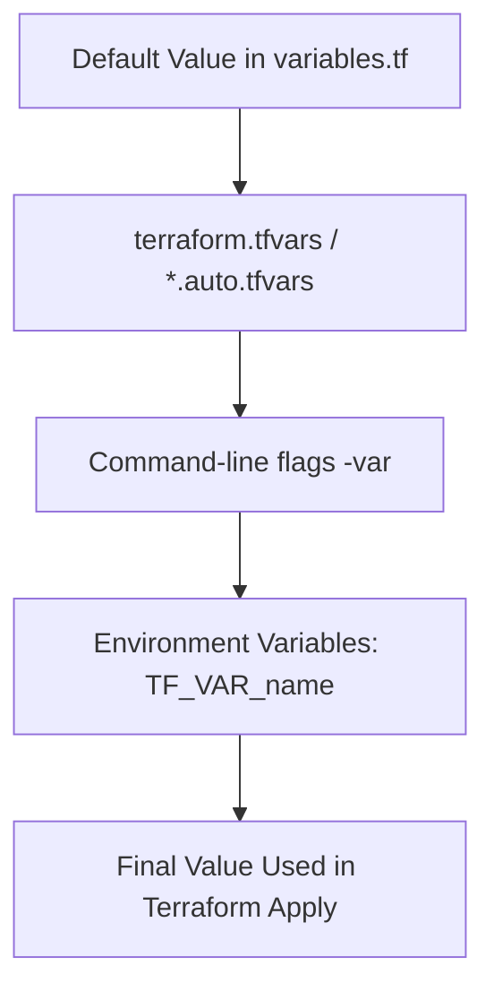

# 🌍 Terraform Variables Cheatsheet

Terraform uses variables to make configurations **reusable, flexible, and clean**.  
A common practice is to define variables in a **`variables.tf`** file.

---

## 📌 Variable Block Structure

```hcl
variable "name" {
  type        = <TYPE>         # Data type (string, number, bool, list, map, object, tuple)
  description = "Explanation"  # What the variable is used for
  default     = <VALUE>        # (Optional) default value
}
```

## 📌 Common Variable Types with Examples

### 🔹 String
```hcl
variable "instance_type" {
  type        = string
  description = "EC2 instance type"
  default     = "t2.micro"
}
```

### 🔹 Number
```hcl
variable "instance_count" {
  type        = number
  description = "Number of EC2 instances"
  default     = 2
}
```

### 🔹 Boolean
```hcl
variable "enable_monitoring" {
  type        = bool
  description = "Enable CloudWatch monitoring"
  default     = true
}
```

### 🔹 List
```hcl
variable "allowed_ips" {
  type        = list(string)
  description = "List of allowed IP addresses"
  default     = ["0.0.0.0/0", "192.168.1.1/32"]
}
```

### 🔹 Map
```hcl
variable "tags" {
  type        = map(string)
  description = "Tags to apply to resources"
  default     = {
    Environment = "dev"
    Owner       = "team-a"
  }
}
```

### 🔹 Object
```hcl
variable "instance_config" {
  type = object({
    instance_type = string
    volume_size   = number
    monitoring    = bool
  })
  default = {
    instance_type = "t3.micro"
    volume_size   = 20
    monitoring    = true
  }
}
```

### 🔹 Tuple
```hcl
variable "mixed_values" {
  type = tuple([string, number, bool])
  default = ["app-server", 3, true]
}
```

## 📌 Using Variables in Terraform

In `main.tf`:

```hcl
provider "aws" {
  region = var.region
}

resource "aws_instance" "example" {
  ami           = "ami-12345678"
  instance_type = var.instance_type
  count         = var.instance_count
}
```

## 📌 Assigning Variable Values

1️⃣ **Default values** (inside `variables.tf`)  
```hcl
default = "t2.micro"
```

2️⃣ **.tfvars file (recommended)**  
```hcl
# terraform.tfvars
region         = "us-east-1"
instance_type  = "t3.micro"
instance_count = 2
```

Run:
```bash
terraform apply -var-file="terraform.tfvars"
```

3️⃣ **Command-line flags**  
```bash
terraform apply -var="region=us-west-2" -var="instance_count=3"
```

4️⃣ **Environment variables**  
```bash
export TF_VAR_region="ap-south-1"
```

## 📌 Best Practices ✅

- Use `variables.tf` to declare variables.
- Use `terraform.tfvars` (or `*.auto.tfvars`) to store values.
- Add descriptions for readability.
- Use types to avoid accidental misconfigurations.
- Keep sensitive values (like passwords, keys) in `.tfvars` files and never commit them.

## 📊 Terraform Variable Precedence (Flow Diagram)



## ➡️ Order of Precedence: Default < tfvars < CLI < Env

---

## 🎓 Quick Questions
### 📝 Exam Questions & Answers

**Q:** What happens if a variable has no default value?  
**A:** Terraform prompts for input.

**Q:** Which file is typically used to define variables?  
**A:** `variables.tf`

**Q:** How do you pass a variable via CLI?  
**A:** `terraform apply -var="region=us-east-1"`

**Q:** What is the difference between list and map variables?  
**A:** list is ordered values; map is key-value pairs.

**Q:** How do you define multiple variable values automatically?  
**A:** Use `.auto.tfvars` files.

---

## 💼 Interview Questions & Answers

**Q:** Why use variables in Terraform?  
**A:** To make configurations reusable and avoid hardcoding values.

**Q:** How do you manage sensitive variables?  
**A:** Store in `.tfvars` or use Terraform Cloud/Secrets Manager.

**Q:** Can you override variables defined in `.tfvars`?  
**A:** Yes, using CLI or environment variables.

**Q:** How do you provide default values for variables?  
**A:** By using the `default` argument inside `variables.tf`.

**Q:** What is the role of type constraints in variables?  
**A:** Ensures that only correct data types are passed to Terraform.

---

## 🎓⚡ Advanced Exam Questions & Answers

**Q:** What happens if you declare a variable without a type?  
**A:** Terraform infers the type from the default or user input.

**Q:** How do you validate variable inputs?  
**A:** Using the `validation` block in variable definitions.

**Q:** How do you pass complex structures to variables?  
**A:** Using objects, lists, or maps.

**Q:** Can you make a variable optional?  
**A:** Yes, by giving it a default value.

**Q:** What is the use of `nullable` argument in variables?  
**A:** Allows variables to accept null values.

---

## 💼⚡ Advanced Interview Questions & Answers

**Q:** How do you structure variables for multi-environment setups (dev, staging, prod)?  
**A:** Use workspaces or separate `.tfvars` files for each environment.

**Q:** Can you dynamically assign values to variables?  
**A:** Yes, using Terraform locals or data sources.

**Q:** How do you secure variables in a CI/CD pipeline?  
**A:** Store them in environment secrets (GitHub Actions, Jenkins, etc.).

**Q:** What’s the difference between locals and variables?  
**A:** Variables are inputs; locals are computed values within configuration.

**Q:** How do you handle variable versioning in Terraform modules?  
**A:** Use clear `variables.tf` with type constraints and default values for backward compatibility.
